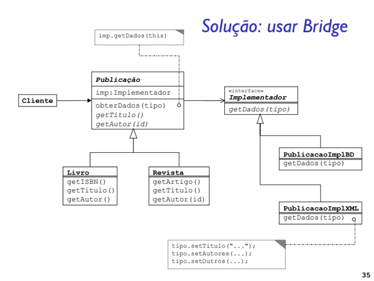

# 🌉 Padrão Bridge

Este diretório apresenta a implementação do padrão de projeto Bridge, construída a partir do diagrama de classes exibido abaixo. A proposta é reforçar o entendimento do padrão por meio da prática, consolidando os conceitos discutidos em sala de aula.

